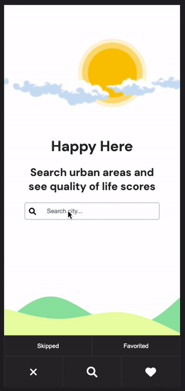

# AJAX Project - Happy Here - README
A dynamic HTML, CSS, and JavaScript solo project for professionals who want to relocate to urban areas

## Inspiration
This project was inspired by my 2 years living abroad, itch for travel, and plan for relocating as I break into tech.

## Technologies Used
- HTML5
- CSS3
- JavaScript

## Features
- User can search for cities (urban areas)
- User can view city stats & summary
- User can add cities to a favorited or skipped list
- User can view their favorited or skipped lists
- User can remove cities from their favorited or skipped lists
## Try it Out
Try the application [Here](https://anthonyvngo.github.io/ajax-project/)
## Demo

