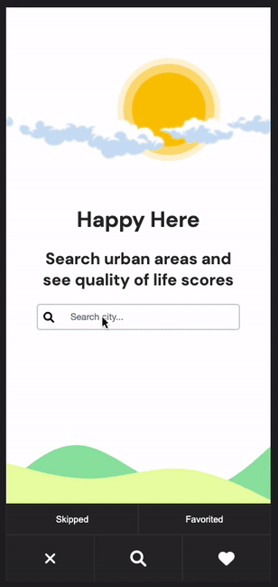

# ajax-project - Happy Here

A dynamic HTML, CSS, and JavaScript solo project for professionals who want to relocate to urban areas

This project was inspired by my 2 years living abroad, itch for travel, and plan for relocating as I break into tech.

## Live Demo

Try the application live at [https://anthonyvngo.github.io/ajax-project/] (https://anthonyvngo.github.io/ajax-project/)

## Technologies Used

-HTML5
-CSS3
-JavaScript

# Features

-User can search for cities (urban areas)
-User can view city stats & summary
-User can add cities to a favorited or skipped list
-User can view their favorited or skipped lists
-User can remove cities from their favorited or skipped lists

# Demo

